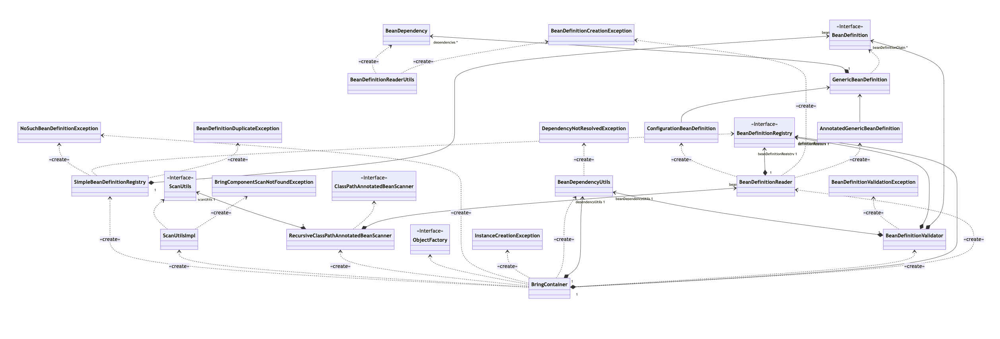
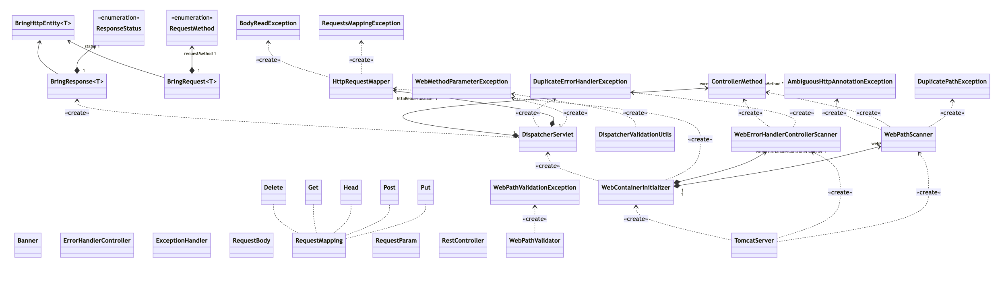

# Bring Framework  [](https://opensource.org/licenses/Apache-2.0)
 [](https://sonarcloud.io/summary/new_code?id=bobocode-breskul_bring) [](https://sonarcloud.io/summary/new_code?id=bobocode-breskul_bring) [](https://sonarcloud.io/summary/new_code?id=bobocode-breskul_bring)

## What is Bring Framework?
Bring Framework is a custom lightweight and flexible web framework for building Java-based web applications that combines HTTP request handling with a Dependency Injection container.
It uses IoC (Inversion of Control) container, which allows to create objects and it's dependencies in declarative way.

## Table of Contents

- [Introduction](#introduction)
- [Features](#features)
- [Getting Started](#getting-started)
- [Usage](#usage)
- [Contributing](#contributing)
- [License](#license)

## Introduction

Bring Framework is designed to simplify the development of web applications in Java. It follows the Model-View-Controller (MVC) architecture and integrates with the Inversion of Control (IoC) container for dependency injection.

## Infrastructure

IOC

[Click here](https://mermaid.live/view#pako:eNqtV11P2zAU_SuWH1Gp2qYNaYSQRoGJh7EJtj1MeTHObespvYkSB9EhfhE_YW_8sjn9SHHruC7spVVuzr0-Pr4-dp4oT2OgIeUJK4oLwSY5m0UYixy4FCmS8-8RLt6RT4ipZBLiz4CQC34ODC9gLFBUwDVKj5KnCE9Pr1FCPmYczs4iBXw2Y0c5sOr_8pFD1lzyoswSwRWPPbhbYDHktnc_pEiKJsBEFDKfH8L_J0tE7DKDFTDdIpcBxoB8bo7qZHOBk1E6y1IElHec4U0qr9IS492hl1CUTOBGjlH1-43Jab2o1WhVIQWyT1rVGotJmS9mau6BDWtF6xaKNHmAXWbWNrrGQjLk0NgUN-ldyad68g7o6_1v1cZXjCux96zlLfAyL8QDWKVZo6vHxYrYi9aw61mW1EGhHsDcb1W2fZ8Rcnx8RszikQhNfU5Iu61S9tQNyesLr9SG17_WOnt2rUuhiHYjSo6qmUT03rzzKkTDprTSs_SnA7Xlov6vie5WW28Ma3JtEDahRlO1o8nRjkrEsVr8Ick3RU1aGazw_RPWHPANRz2-LqlHl-TsfrTNTDNM4_RW_WbN-5jW-zlsJDuEhrOWzQR0qIN2jVbukmy1eZcC-hHQAHIzf5fhNMd3SrCcBlv5NmeznwoNJ4mhrRrB5kYSULyxoNrcInRU1HoQLDaZaZ8szxDXMVbHgp3HuwgX9S2gCm7uBBHqbbASev-lbWvBTVW0UWy9Y5H2C8vMB4e1oKlddi_j21M4tOIbF3TIPcQeaIvOIJ8xEavPHXVtI0oXOYUZRDRcejQrExlRdX9TUFbK9G6OnIYyL6FFy0y5Law-kPTgZSyUudBwzJJCBTOGv9K0xqhHGj7RRxp2u1671_P9YNjpnATdXv-kRecqPGwHnaHvDfpBEAx9f-A9t-ifRYVOO-gNfK_v-R2v6_W7g8HzP-HlDXs)
for details

Bring Web Server

[Click here](https://mermaid.live/view#pako:eNqVVs1u4jAQfpXIx4oiIJBCVCG1W9TuoRIq7K60ysVN3GIp2Fnb2S2t2hfaR9hbn2zHIf9OINySmW_-vhmP_YZ8HhDkIj_EUt5Q_Czw1mMBFcRXlDPreu2xRGddbR_pc8xjeadUdMUYV1gjFi8-ifRHhrvGjBGR__Fg90BwYMIEZc_a1YIpqnYf64-K5oH8iolUplhGnElSkn_hTAkehkTcE7XhQSa_ISFRJP-jMsLK3xCxIuI3aEzFdxzSIKnpm6KhzAFxFFIfK7IQgos7zAIIZZSTo5ZYbQxt2bTIN9dm8BSRyW-LLO-AwvwbSEvpucdRVOCXXOYGyzj_TLG6EzWRNgdS69KERuvNY5eXhMVbIhJS5nMP6nmvgZc4GZiKTKZ-DRqy7q1gdGJ5PIJUJllrvgWadRML2Q_yqIGYwuB9ZVRR6ORrRd3cgJVfmVXA7WtPioLhMdsMEN1g01BLiwFqs0sRXOhCa3NuWefnc6vhXFgm1ENDD1ln2sBDotI2rag2MjfPj06HUAW2EkvuO7cPUmmmx6pDZVn9vpUeQlAa50_rsxzK4Vzr868vCJykz39NZpV0SMbzmjd3OKXgDEwMYXtSh4_8aSlu6qc1Ic84wweyOTCWranUdtnJnpp6eatLa9To7QQqs6i0x_U7oBasza5tnXTIVa_ClmRhM4KmvEYKdpq2SC1as-HB_dLJQ2mt1PBteaWzakzNKdYm9d2sKyP-51j9GnuUpO7BylSlrsuixNHhWPvijY1g1N7Fy0nLopbq3sOxl1UXH8drMW2a3yzNlvnNVZ3YhiuvZo96CO73LaYBvDLhxregh2pDtsRDLnwG5AnHofIQXPwAxbHiqx3zkatETHoojsA7Sd-lVeEioJAOcp9wKEEYYfaT8xwDv8h9Qy_IHQ7t_mjkONPZYHAxHY7GFz20A_GsPx3MHHsynk6nM8eZ2O899Jp4GPSno4ljj21nYA_t8XAyef8PIcMoxQ)
for details
## Features

- **Dependency Injection Container**:
    - Ensures a fast failure: The application won't run if configured improperly. This includes scenarios like missing dependency bean definitions, cyclic bean dependencies, invalid bean naming, multiple bean constructors, and multiple `@Autowired` constructors.

- **Bean declaration**:
    - Declare beans in two ways:
        - By annotation
        - By Java configuration (partially, singleton only)

- **Bean Dependencies Processing**:
    - Inject dependencies by type, supporting:
        - Direct class
        - Interface usage
        - Injection by name
        - Injection by qualifier
        - Injection by primary
        - Injection by `@Autowired` constructor parameter

- **Injection strategy**: By constructor only

- **Bean Scope Options**:
    - Singletone
    - Prototype

- **Embedded Tomcat HTTP Server**:
    - Efficiently deploy and run your application with the built-in Tomcat-based HTTP server.

- **Dispatcher mapping**:
    - RestControllers as IoC beans
    - RequestMapping for class
    - CRUD mapping for methods (GET, POST, PUT, DELETE, HEAD)

- **Controller Method Parameters Injection (Combination)**:
    - Inject parameters using a combination of:
        - `HttpServletRequest`/`HttpServletResponse`
        - `@RequestBody` annotation for plain text or JSON
        - `@RequestParam` annotation
        - User-friendly request wrapper, `BringRequest` object as plain text or JSON

-  **Controller Response Handling**:
    - Handle responses with ease:
        - Support any raw object in plain text or JSON
        - Use the user-friendly `BringResponse` for bytes, plain text, or JSON

- **Custom Exception Handling**:
    - Customize how exceptions are handled with flexible advice.
- **Application Properties**:
    - Easily control your application's configuration using properties:
        - Configure the embedded Tomcat port
        - Adjust logging levels
        - Toggle the banner on or off

## Getting Started

Follow these steps to integrate Bring Framework into your project:

1. Open your project's `pom.xml` file.
2. Add the following Maven dependency:

```xml
<dependency>
  <groupId>io.github.bobocode-breskul</groupId>
  <artifactId>bring</artifactId>
  <version>2.1</version>
</dependency>
```
Find the simple CRUD example of a Bring application [here](https://github.com/bobocode-breskul/bring-crud-example).

## Usage

### Example 1: Launch HTTP application

1. **Ensure Main Application Class is in a Package:**
    - The main application class should be located within a specific package. The default (non-packaged) configuration is not supported.

2. **Use `@BringComponentScan` Annotation:**
    - Annotate your main application class with `@BringComponentScan` to instruct Bring Framework to scan for components in the specified package.

3. **Launch the HTTP Application:**
    - In the `main` method of your main application class, use `BringContainer.run(App.class)` to read all beans in the package and initiate the HTTP application.

Example:

```java
@BringComponentScan
public class App {
    public static void main(String[] args) {
        BringContainer.run(App.class);
    }
}
```
### Example 2: Bean declaration
1. Annotation based bean declaration:
    - Use `@BringComponent` to mark a class as a bean.
```java
@BringComponent
public class NestedBean {
}
```
2. Java configuration based bean declaration
   Define beans using Java configuration classes for flexible integration with Bring Framework:
    - Use `@BringConfiguration` to mark a class as a Java configuration class.
    - Annotate methods with `@BringBean` to define beans within the configuration class.
```java
@BringConfiguration
public class Config {

  @BringBean
  public ObjectMapper getObjectMapper() {
    return new ObjectMapper();
  }

  @BringBean
  public ParentBean getParent(BeanSample beanSample, AnnotatedBean annotatedBean) {
    return new ParentBean(beanSample, annotatedBean);
  }

  @BringBean
  public BeanSample getBeanSample() {
    return new packag.BeanSample();
  }
}
```
### Example 3: Simple dependency injection
Dependencies could be injected only by constructors. If no dependencies defined then default constructor will be used for bean creation.
Dependency injection using simple direct classes:
```java
@BringComponent  
public class CallerService {  
    private final DependencyService dependencyService;  
  
    public CallerService(DependencyService dependencyService) {  
        this.dependencyService = dependencyService;  
    }  
  
    public String doCall(String input) {  
        return dependencyService.doWork(input);  
    }  
}

@BringComponent  
public class DependencyServiceImpl implements DependencyService {  
    public String doWork(String input) {  
        //... do logic  
        return "RESULT";  
    }  
}

public interface DependencyService {  
    String doWork(String input);  
}
```
### Example 4: Handling ambiguous beans creation
When a bean has multiple constructors, use the `@Autowired` annotation to explicitly specify the intended constructor for instantiation.

If more than one interface candidate is available, the dependent bean should be marked as `@Primary` to indicate that this bean should be used by default. Additionally, a bean can specify its name using `@BringComponent("NAME")`, and `@Qualifier("NAME")` can be used on the constructor parameter to indicate the selected bean.
```java
@BringComponent  
public class CallerService {  
    private final DependencyService dependencyServiceOne;  
    private final DependencyService dependencyServiceTwo;  
  
    public CallerService(DependencyService dependencyServiceOne) {  
        this.dependencyServiceOne = dependencyServiceOne;  
        this.dependencyServiceTwo = null;  
    }  
  
    // constructor is used for bean creation using @Autowired  
    @Autowired  
    public CallerService(DependencyService dependencyServiceOne, @Qualifier("ServiceB") DependencyService dependencyServiceTwo) {  
        // set using @Primary  
       this.dependencyServiceOne = dependencyServiceOne;  
       // set using @Qualifier  
       this.dependencyServiceTwo = dependencyServiceTwo;  
    }  
  
    public String doCall(String input) {  
        return dependencyServiceOne.doWork(input);  
    }  
}

@Primary  
@BringComponent("ServiceA")  
public class DependencyServiceA implements DependencyService {  
    public String doWork(String input) {  
        //... do logic  
        return "A " + input;  
    }  
}

@BringComponent("ServiceB")  
public class DependencyServiceB implements DependencyService {  
    @Override  
  public String doWork(String input) {  
      //... do logic  
      return "A " + input;  
  }  
}

public interface DependencyService {  
    String doWork(String input);  
}
```
### Example 5: Defining bean scope:
Define SINGLETON bean (if the value attribute is not set explicitly, the default assumption is that the scope is singleton):
```java
@BringComponent
@Scope
public class MyBean {
}
```
or

```java
@BringComponent
@Scope("singleton")
public class MyBean {
}
```
    
Define bean scope prototype:

```java
@BringComponent
@Scope("prototype")
public class MyBean {
}
```
### Example 6: Dispatcher mapping
Let's create our simple CRUD controller.

Create new controller PictureController, and add two annotations `@RestController` and `@RequestMapping("/pictures")`, where `/pictures`  is the web path.

```java 
@RestController  
@RequestMapping("/pictures")  
public class PictureController {}
```

Now, let's add new methods to handle `GET`, `POST`, `PUT`, `DELETE` requests. To specify that our methods handle HTTP requests, we can use the corresponding annotations: `@Get`, `@Post`, `@Put`, `@Delete`, `@Head`.

If we wish to modify the method's request mapping, we can add a value, for instance, `@Get("/first")`. By default, the request mapping for HTTP annotations is empty and inherits the configuration from the `@RequestMapping` annotation defined in the class.

```java 
@RestController
@RequestMapping("/pictures")
public class PictureController {
  private final ObjectMapper mapper = new ObjectMapper();
  private final Map<Integer, PictureDto> storage = new HashMap<>();

  @Get
  public BringResponse<JsonNode> getAllPictures() {
    JsonNode node = mapper.valueToTree(storage);
    return BringResponse.ok(node);
  }

  @Post
  public BringResponse<JsonNode> addPicture(@RequestBody PictureDto picture) {
    storage.put(picture.getId(), picture);
    JsonNode node = mapper.valueToTree(picture);

    return new BringResponse<>(null, null, ResponseStatus.CREATED);
  }

  @Put
  public BringResponse<JsonNode> updatePicture(@RequestBody PictureDto picture) {
    storage.put(picture.getId(), picture);
    JsonNode node = mapper.valueToTree(picture);

    return BringResponse.ok(node);
  }

  @Delete
  public BringResponse<Void> removeAllPictures() {
    storage.clear();

    return new BringResponse<>(null, null, ResponseStatus.NO_CONTENT);
  }

  @Head
  public BringResponse<Void> head() {
    return new BringResponse<>(null,
        Map.of("headerkey", "HeaderValue"),
        ResponseStatus.NO_CONTENT);
  }
}
```
Alternatively, you can download our example CRUD application [here](https://github.com/bobocode-breskul/bring-crud-example).

### Example 7: Controller method input handling

The controller is capable of handling input in various ways and combinations:

-   `HttpServletRequest`/`HttpServletResponse` as parameters
-   Request parameter using `@RequestParam` annotation
-   Raw object using `@RequestBody` annotation (accepts plain text or JSON as input)
-   User-friendly request wrapper using `BringRequest<>` object (accepts plain text or JSON as input), providing information such as URL, HTTP request method, headers, and body.

All the mentioned method parameters can be easily combined to achieve optimal flexibility and maximum results.

`HttpServletRequest` and `HttpServletResponse` method parameter injection:
```java
@Get("/get-servlet-request")  
public void postWithHttpServlet(HttpServletRequest request, HttpServletResponse response) {  
    // do work with request and response  
}
```
Request parameter method injection:
```java
@Get("/get-request-param")  
public void getRequestParam(@RequestParam("name") String name) {  
    // do work with request param  
}
```
Request body method injection:
```java
@Post("/post-request-body")  
public void postRawObject(@RequestBody PersonDto person) {  
    // do work with DTO  
}
```
Request body with `HttpServletRequest` combination method injection:
```java
@Post("/post-request-body-servlet")  
public void postRawObjectWithHttpServlet(@RequestBody PersonDto person, HttpServletRequest request) {  
    // do work with DTO  
}
```
User-friendly request wrapper using BringRequest<>:
```java
@Post("/post-http-entity")  
public void postEntity(BringRequest<PersonDto> personRequest) {  
    // do work with http entity  
}
```
BringRequest with @RequestMethod annotation combination:
```java
@Post("/post-http-entity-param")  
public void postEntityWithRequestParam(BringRequest<PersonDto> personRequest, @RequestParam("name") String name) {  
    // do work with http entity and param  
}
```
### Example 8: Controller method response handling:
Try out user friendly response wrapper `BringResponse` object as bytes, plain text or JSON
```java
@RestController
@RequestMapping
public class BaseController {
  private final ObjectMapper mapper = new ObjectMapper();

  @Get("/json")
  public BringResponse<JsonNode> doGetJson() {
    RequestDto dto = new RequestDto();
    dto.setString("Hello world");
    dto.setInteger(42);

    JsonNode node = mapper.valueToTree(dto);
    return BringResponse.ok(node);
  }

  @Get("/text")
  public BringResponse<String> doGetText() {
    RequestDto dto = new RequestDto();
    dto.setString("Hello world");
    dto.setInteger(42);

    return BringResponse.ok(dto.toString());
  }

  @Get("/byte")
  public BringResponse<byte[]> doGetByte() {
    RequestDto dto = new RequestDto();
    dto.setString("Hello world");
    dto.setInteger(42);

    return BringResponse.ok(dto.toString().getBytes());
  }
}
```
### Example 9: Customisation of exception handling
Create your custom exception handler using `@ErrorHandlerController` and `@ExceptionHandler`.
```java
@ErrorHandlerController
public class GlobalErrorHandler {

  @ExceptionHandler
  public BringResponse<String> handleResourceNotFoundException(ResourceNotFoundException ex) {
    return new BringResponse<>(ex.getMessage(), Map.of("TestHeader", "TestValue"), 
        ResponseStatus.NOT_FOUND);
  }

  @ExceptionHandler
  public BringResponse<String> handleResourceNotFoundException(SystemEngineException ex, HttpServletRequest req) {
    String errorMessage = 
        "An error occurs when reaching [%s] due to [%s]".formatted(req.getPath, ex.getMessage());
    return new BringResponse<>(ex.getMessage(), Map.of("TestHeader", "TestValue"),
        ResponseStatus.INTERNAL_SERVER_ERROR);
  }
}
```
### Example 10: Properties application configuration
You can configure your application using property file.

Create `application.properties` file in the resources folder.
Configuration has some pre-defined options:

```properties
server.port=<SERVER PORT NUMBER>
banner=<BOOLEAN>
logging=<LOGGING LEVEL [INFO|DEBUG|WARN|ERROR]>
```

Also you can add your own properties and use them using `PropertiesConfiguration` class with following methods:
- `getProperty` - Method returns property integer value loaded from configuration file. If property does not exist throws PropertyNotFoundException.
- `getPropertyOrDefault` - Method returns property string value loaded from configuration file or returns default value if property doesn't exist.
- `getPropertyAsInt` - Method returns property integer value loaded from configuration file. If property does not exist throws PropertyNotFoundException.
- `getPropertyAsIntOrDefault` - Method returns property integer value loaded from configuration file or returns default value if property doesn't exist.

## Contributing
We welcome contributions!
If you'd like to contribute to Bring, please contact with the team Breskul.


## License
This project is licensed under the [Apache License](https://opensource.org/licenses/Apache-2.0).
